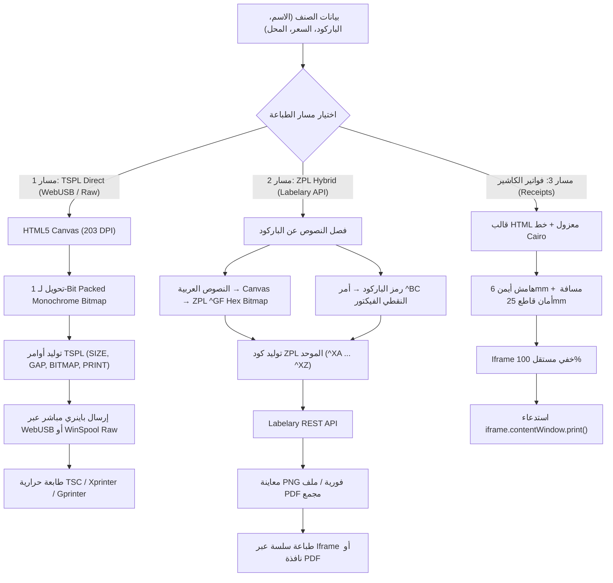

# 🏷️ المرجع الشامل والنهائي لتصميم وهندسة طباعة ملصقات الباركود والفواتير الحرارية
## (The Ultimate Master Reference: Barcode Label Printing & Thermal Print Engine)

> **الغرض من هذا المرجع:**  
> هذا الدليل تم استخلاصه وتوثيقه بالكامل وبأدق التفاصيل الرياضية والهندسية من واقع التجارب المعملية وضبط أبعاد الطباعة في مشروع نقطة البيع (POS).  
> هذا الملف صُمم ليكون **المرجع الذهبي (Golden Blueprint)** الذي يمكنك نسخه والاعتماد عليه في أي مشروع مستقبلي (Web, React, Vue, Electron, Node.js, Python, Laravel, C#) دون الحاجة لإعادة التجربة أو تضييع الساعات في معايرة الأبعاد ومشاكل اللغة العربية.

---

## 📑 فهرس المحتويات

1. [المعمارية العامة وفلسفة محرك الطباعة (Architecture & Printing Pipelines)](#1-المعمارية-العامة-وفلسفة-محرك-الطباعة)
2. [الأبعاد والمقاسات الذهبية القياسية (The Golden Preset Specs)](#2-الأبعاد-والمقاسات-الذهبية-القياسية)
3. [معادلات التحويل الرياضية وقواعد الـ DPI (Mathematical Conversions & DPI)](#3-معادلات-التحويل-الرياضية-وقواعد-الـ-dpi)
4. [حل معضلة اللغة العربية في الطابعات الحرارية (The Arabic Thermal Dilemma & Solution)](#4-حل-معضلة-اللغة-العربية-في-الطابعات-الحرارية)
5. [المسار الأول: محرك TSPL المباشر و 1-Bit Packed Bitmap (Pure TSPL Engine)](#5-المسار-الأول-محرك-tspl-المباشر-و-1-bit-packed-bitmap)
6. [المسار الثاني: محرك ZPL الهجين عبر Labelary API (Vector + ^GF Bitmap)](#6-المسار-الثاني-محرك-zpl-الهجين-عبر-labelary-api)
7. [طرق إرسال الأوامر للطابعة في مختلف البيئات (Printing Transport Layers)](#7-طرق-إرسال-الأوامر-للطابعة-في-مختلف-البيئات)
8. [طباعة الفواتير الحرارية وحل مشاكل القطع وهوامش العربي (Thermal Receipt Engine)](#8-طباعة-الفواتير-الحرارية-وحس-مشاكل-القطع-وهوامش-العربي)
9. [كود برمجي جاهز للنسخ الفوري لأي مشروع (Drop-in Production Modules)](#9-كود-برمجي-جاهز-للنسخ-الفوري-لأي-مشروع)
10. [دليل الأخطاء الشائعة واستكشاف المشاكل (Troubleshooting & Pitfalls)](#10-دليل-الأخطاء-الشائعة-واستكشاف-المشاكل)

---

## 1. المعمارية العامة وفلسفة محرك الطباعة

يعتمد النظام على **3 مسارات طباعة متخصصة** تم تصميمها لتغطية كافة أنواع الطابعات وظروف التشغيل:



---

## 2. الأبعاد والمقاسات الذهبية القياسية

الملصق القياسي العالمي لقطاع التجزئة، الجوالات، الملابس، وقطع الغيار هو:
$$\mathbf{42.5\text{ mm} \times 25.0\text{ mm}}$$

### أ. جدول الأبعاد القياسية (Physical Sheet Spec)

| الخاصية | القيمة بالمليمتر (mm) | القيمة بالنقاط (Dots @ 203 DPI) | الوصف الهندسي |
| :--- | :--- | :--- | :--- |
| **عرض الورقة (Width)** | `42.5 mm` | **340 Dots** | العرض الكلي لرول الملصق |
| **ارتفاع الورقة (Height)** | `25.0 mm` | **200 Dots** | الارتفاع الفعلي للملصق الواحد |
| **الفجوة بين الملصقات (Gap)** | `1.0 mm` | **8 Dots** | الفاصل الحساس لحساس الطابعة (Gap Sensor) |
| **الهامش العلوي (Margin Top)** | `0.6 mm` | **5 Dots** | تفادي الحرق على حافة الورقة |
| **الهامش السفلي (Margin Bottom)** | `0.5 mm` | **4 Dots** | حماية السعر واسم المنشأ من التآكل |
| **الهامش الأيسر (Margin Left)** | `0.4 mm` | **3 Dots** | حماية الباركود من الحافة |
| **الهامش الأيمن (Margin Right)** | `0.5 mm` | **4 Dots** | منع اقتطاع أول حرف عربي |

---

### ب. جدول إحداثيات ومقاسات العناصر الداخلية (The Golden Coordinates)

توزيع العناصر داخل الملصق بحسابات تم ضبطها لضمان قراءة فورية بالماسح الضوئي (Barcode Scanner) وظهور خط عربي عريض ومقروء:

| العنصر | موضع X (mm) | موضع Y (mm) | موضع X (Dots) | موضع Y (Dots) | حجم الخط (Font Size) | المحاذاة | ملاحظات المعايرة |
| :--- | :--- | :--- | :--- | :--- | :--- | :--- | :--- |
| **اسم المتجر (Store Name)** | `20.6 mm` | `1.8 mm` | 165 Dots | 14 Dots | `20 pt` (Cairo Bold) | منتصف (Center) | أعلى الملصق |
| **اسم الصنف (Product Name)** | `20.7 mm` | `5.2 mm` | 166 Dots | 42 Dots | `16 pt` (Cairo Bold) | منتصف (Center) | اقتطاع بعد 26-30 حرف |
| **شريط الباركود (Barcode 128)** | `9.7 mm` | `9.0 mm` | 78 Dots | 72 Dots | Module Width: `2`, Height: `45 Dots` | حسب طول الكود | كود CODE128 |
| **سعر البيع (Price)** | `4.8 mm` | `18.5 mm` | 38 Dots | 148 Dots | `18 pt` (Cairo 900) | يسار (Left) | تنسيق: `ج.م 150` |
| **المنشأ / الضمان (Origin)** | `38.0 mm` | `18.5 mm` | 304 Dots | 148 Dots | `13 pt` (Cairo 600) | يمين (Right) | تنسيق: `صنع في مصر` |

---

### ج. كائن الإعدادات الافتراضي كودياً (Default Config Object)

```typescript
export const DEFAULT_BARCODE_CONFIG = {
  // أبعاد الورقة
  widthMm: 42.5,
  heightMm: 25.0,
  gap: 1.0,
  marginTop: 0.6,
  marginBottom: 0.5,
  marginLeft: 0.4,
  marginRight: 0.5,

  // اسم المحل
  storeX: 20.6,
  storeY: 1.8,
  storeFontSize: 20,
  showStoreName: true,
  customStoreName: 'المهندس للاتصالات',

  // اسم الصنف
  nameX: 20.7,
  nameY: 5.2,
  nameFontSize: 16,
  showProductName: true,

  // الباركود
  barcodeX: 9.7,
  barcodeY: 9.0,
  scaleWidth: 2,   // سمك أصغر خط بالنقاط (Narrow bar module width)
  scaleHeight: 45, // ارتفاع خطوط الباركود بالنقاط
  showText: true,  // إظهار الأرقام تحت الخطوط
  showBarcode: true,

  // السعر
  priceX: 4.8,
  priceY: 18.5,
  priceFontSize: 18,
  showPrice: true,

  // بلد المنشأ / الملاحظة
  originX: 38.0,
  originY: 18.5,
  originFontSize: 13,
  showOrigin: true,
  customOriginText: 'صنع في مصر',

  // دقة الطابعة
  dpi: 203
};
```

---

## 3. معادلات التحويل الرياضية وقواعد الـ DPI

تتعامل رؤوس الطابعات الحرارية ميكانيكياً بمصفوفة إبر حرق صغيرة تُسمى **النقاط (Dots)**.

### أ. المعادلات الأساسية

$$\text{Dots} = \text{Math.round}\left( \frac{\text{mm} \times \text{DPI}}{25.4} \right)$$

$$\text{mm} = \text{Math.round}\left( \frac{\text{Dots} \times 25.4}{\text{DPI}} \times 10 \right) / 10$$

### ب. جدول كثافات الطابعات الحرارية الشائعة

| دقة الطابعة (DPI) | عدد النقاط لكل مليمتر (Dots / mm) | مقاس ملصق 42.5 × 25 مم بالنقاط | الماركات الشائعة |
| :--- | :--- | :--- | :--- |
| **203 DPI** *(القياسي 90%)* | **8.0 Dots / mm** | **340 × 200 Dots** | Xprinter, TSC, Zebra, Rongta, Gprinter |
| **300 DPI** | **11.81 Dots / mm** | **502 × 295 Dots** | Zebra الصناعية, Godex HD |
| **600 DPI** | **23.62 Dots / mm** | **1004 × 591 Dots** | طابعات المجوهرات والشرائح الدقيقة |

---

## 4. حل معضلة اللغة العربية في الطابعات الحرارية

### المشكلة:
1. الطابعات الحرارية تحتوي في شريحة الـ ROM على خطوط ASCII اللاتينية فقط، أو خط صيني داخلي.
2. عند إرسال نص عربي مباشر عبر أوامر الطابعة (مثل أمر `TEXT` في TSPL أو `^FD` في ZPL)، يحدث التالي:
   - طباعة حروف إنجليزية وعلامات استفهام غير مفهومة مثل `????` أو رموز غريبة.
   - أو طباعة الحروف العربية **مقطعة ومعكوسة من اليسار لليمين** (مثال: `س ل ا م` بدلاً من `سلام`).

### الحل الهندسي المعتمد في هذا المشروع:
1. **في مسار TSPL:**  
   رسم الملصق بالكامل على **HTML5 Canvas** باستخدام خط `Cairo` بنمط Bold و RTL، ثم تحويل الكانفاس لـ **1-Bit Monochrome Bitmap** حيث البت `0` يعني حرق حراري أسود، والبت `1` أبيض، وإرساله عبر أمر `BITMAP`.
2. **في مسار ZPL:**  
   فصل العناصر؛ النصوص العربية تُحوّل عبر كانفاس مصغر إلى بايتات هيكس وتُحقن بأمر `^GF` (Graphic Field Bitmap)، بينما رمز الباركود يُطبع بأمر ZPL الأصلي `^BC` للحفاظ على دقة الزوايا والشعيرات.

---

## 5. المسار الأول: محرك TSPL المباشر و 1-Bit Packed Bitmap

### أ. هيكل أمر TSPL المتولد:
```tspl
SIZE 42.5 mm, 25 mm
GAP 1 mm, 0 mm
DIRECTION 1
CLS
BITMAP 0,0,43,200,0,[STREAM_OF_PACKED_BYTES]
PRINT 1,1
```

* `SIZE`: يحدد أبعاد الورقة بالمليمتر.
* `GAP`: الفجوة بين الملصقات (1 مم).
* `DIRECTION 1`: تحديد اتجاه خروج الورقة رأسياً.
* `CLS`: تنظيف الذاكرة المؤقتة للطابعة قبل الرسم.
* `BITMAP X, Y, widthBytes, height, mode, data`:
  - `widthBytes`: عرض الصورة بالبايت = $\lceil \text{widthDots} / 8 \rceil = \lceil 340 / 8 \rceil = 43\text{ Bytes}$.
  - `height`: عدد النقاط الرأسية (200).
  - `mode 0`: وضع الإحلال (Overwrite).
  - `data`: مصفوفة البايتات الخام الثنائية.
* `PRINT 1,1`: طباعة نسخة واحدة ثم التقدم للملصق التالي.

### ب. خوارزمية ضغط الصورة (Canvas to 1-Bit Monochrome Bitmap)

```typescript
export function canvasToMonochromeBitmap(canvas: HTMLCanvasElement): { widthBytes: number; height: number; data: Uint8Array } {
  const ctx = canvas.getContext('2d');
  if (!ctx) throw new Error('No 2d context');

  const w = canvas.width;
  const h = canvas.height;
  const imgData = ctx.getImageData(0, 0, w, h);
  const rgba = imgData.data;

  // في نظام البايت، كل بايت يحتوي على 8 بكسلات
  const widthBytes = Math.ceil(w / 8);
  const packed = new Uint8Array(widthBytes * h);
  
  // ملء الذاكرة باللون الأبيض (0xFF يعني كل البتات 1 في أنظمة TSPL)
  packed.fill(255);

  for (let y = 0; y < h; y++) {
    for (let x = 0; x < w; x++) {
      const idx = (y * w + x) * 4;
      const r = rgba[idx];
      const g = rgba[idx + 1];
      const b = rgba[idx + 2];
      const a = rgba[idx + 3];

      // معادلة الإضاءة القياسية (Luminance Threshold)
      // إذا كانت النقطة شفافة تعامل كأبيض، وإذا كان السطوع < 180 تعتبر سوداء
      const isBlack = (a < 128) ? false : ((0.299 * r + 0.587 * g + 0.114 * b) < 180);

      if (isBlack) {
        const byteIdx = y * widthBytes + Math.floor(x / 8);
        const bitIdx = x % 8;
        // تصفير البت المناظر (في TSPL الصفر يعني تشغيل رأس الحرق الحراري)
        packed[byteIdx] &= ~(1 << (7 - bitIdx));
      }
    }
  }

  return { widthBytes, height: h, data: packed };
}
```

---

## 6. المسار الثاني: محرك ZPL الهجين عبر Labelary API

### أ. لماذا هذا المسار عبقري؟
1. يجمع بين **وضوح الخط العربي الكاليجرافي** (عبر تحويل النصوص العربية إلى كود ZPL `^GF` Hexadecimal).
2. ودقة **رمز الباركود الأصلية (Native Code 128 Vector)** باستخدام أمر الطابعة الداخلي `^BC` لضمان قراءة سريعة من أول ميللي ثانية بأي ماسح ضوئي.
3. يتيح **معاينة بصرية مطابقة للواقع بنسبة 100% (WYSIWYG)** وتوليد ملفات PDF مجمعة بدون الحاجة لتثبيت أي مشغلات طابعات على جهاز المستخدم!

### ب. هيكل كود ZPL المولد:

```zpl
^XA
^PW340
^LL200
^LS0

^FX --- 1. اسم المتجر (عربي نقي ^GF Bitmap) ---
^FO0,14^GFA,1290,1290,43,000000000000000000...^FS

^FX --- 2. اسم الصنف (عربي نقي ^GF Bitmap) ---
^FO0,42^GFA,1290,1290,43,000000000000000000...^FS

^FX --- 3. باركود فيكتور نقي (Code 128) ---
^BY2,2,45
^FO60,72^BCN,45,N,N,N^FD4000123456^FS

^FX --- 4. أرقام الباركود المقروءة بشرياً ---
^FO0,121^FB340,1,0,C^A0N,18,18^FD4000123456^FS

^FX --- 5. السعر والمنشأ (عربي نقي ^GF Bitmap) ---
^FO0,148^GFA,860,860,43,000000000000000000...^FS

^XZ
```

### ج. معادلة توسيط الباركود (Barcode Centering Formula)

لحساب موضع البداية الأفقي `X` للباركود ليكون متسنتر تماماً في منتصف الملصق:
```typescript
export function calculateBarcodeXOffset(barcodeValue: string, moduleWidth = 2, totalDots = 340): number {
  const n = barcodeValue ? barcodeValue.length : 10;
  // في تشفير Code 128: كل رمز يستهلك 11 وحدة، بالإضافة إلى 35 وحدة لرموز البداية والتوقف والتأكيد
  const barcodeWidthDots = (11 * n + 35) * moduleWidth;
  return Math.max(0, Math.round((totalDots - barcodeWidthDots) / 2));
}
```

### د. تكامل Labelary REST API

| الوظيفة | مسار الـ API | نوع الطلب (Method) | الـ Headers المطلوبة | شكل الرد (Response) |
| :--- | :--- | :--- | :--- | :--- |
| **معاينة ملصق واحد (PNG)** | `https://api.labelary.com/v1/printers/8dpmm/labels/{width_inches}x{height_inches}/0/` | `POST` | `Content-Type: application/x-www-form-urlencoded`<br>`Accept: image/png` | صورة `Blob` بصيغة PNG عالية الوضوح |
| **توليد PDF مجمع للطباعة** | `https://api.labelary.com/v1/printers/8dpmm/labels/{width_inches}x{height_inches}/` | `POST` | `Content-Type: application/x-www-form-urlencoded`<br>`Accept: application/pdf` | ملف `Blob` بصيغة PDF يحتوي على صفحات الملصقات |

> **ملاحظة حساب أبعاد البوصة لـ Labelary:**  
> للورقة مقاس $42.5\text{ mm} \times 25.0\text{ mm}$:  
> - العرض بالبوصة: $42.5 / 25.4 = 1.6732\text{ inch}$  
> - الارتفاع بالبوصة: $25.0 / 25.4 = 0.9843\text{ inch}$  
> - الرابط الناتج: `https://api.labelary.com/v1/printers/8dpmm/labels/1.6732x0.9843/0/`

---

## 7. طرق إرسال الأوامر للطابعة في مختلف البيئات

### أ. متصفح الويب المباشر (WebUSB API) - صامت وفوري بدون نافذة
```typescript
export async function sendToWebUSBPrinter(payload: Uint8Array): Promise<boolean> {
  if (!('usb' in navigator)) {
    throw new Error('WebUSB غير مدعوم في هذا المتصفح');
  }
  const device = await (navigator as any).usb.requestDevice({ filters: [] });
  await device.open();
  if (device.configuration === null) await device.selectConfiguration(1);
  await device.claimInterface(0);

  const endpoint = device.configuration.interfaces[0].alternate.endpoints.find(
    (e: any) => e.direction === 'out'
  );
  const endpointNum = endpoint ? endpoint.endpointNumber : 1;

  await device.transferOut(endpointNum, payload);
  await device.close();
  return true;
}
```

### ب. متصفح الويب المباشر (Web Serial API)
```javascript
async function sendToSerialPrinter(tsplPayload) {
  const port = await navigator.serial.requestPort();
  await port.open({ baudRate: 9600 });
  const writer = port.writable.getWriter();
  await writer.write(tsplPayload);
  writer.releaseLock();
  await port.close();
}
```

### ج. شبكة محلية (Network TCP Socket Port 9100)
معظم طابعات الباركود الحرارية المزودة بمدخل Ethernet أو Wi-Fi تستمع افتراضياً على المنفذ `9100`:
* **Node.js:**
  ```javascript
  const net = require('net');
  const client = new net.Socket();
  client.connect(9100, '192.168.1.200', () => {
    client.write(tsplOrZplBuffer);
    client.destroy();
  });
  ```
* **Python:**
  ```python
  import socket
  with socket.socket(socket.AF_INET, socket.SOCK_STREAM) as s:
      s.connect(('192.168.1.200', 9100))
      s.sendall(tspl_or_zpl_bytes)
  ```
* **PHP / Laravel:**
  ```php
  $fp = fsockopen("192.168.1.200", 9100, $errno, $errstr, 5);
  if ($fp) {
      fwrite($fp, $tsplOrZplData);
      fclose($fp);
  }
  ```

---

## 8. طباعة الفواتير الحرارية وحل مشاكل القطع وهوامش العربي

أثناء طباعة فواتير الكاشير الحرارية (إيصالات 80 مم أو 58 مم)، يواجه المطورون مشكلتين رئيستين تم حلهما جذرياً في هذا المشروع:

### أ. مشكلة اقتطاع الحافة اليمنى للغة العربية (Physical Thermal Head Clipping)
رأس الطابعة الحراري الفيزيائي به هامش ميكانيكي غير مطبوع على الحافة (حوالي 3-4 مم). نظراً لأن اللغة العربية تبدأ من اليمين، يتم بتر أول حرف من اسم المتجر أو الأصناف!
* **الحل المعياري المطبق:**
  ```html
  <div style="width: 72mm; max-width: 94%; margin: 0 auto; padding: 2mm 6mm 4mm 4mm; direction: rtl;">
  ```
  - استخدام عرض داخلي `72mm` (لطابعات 80 مم) أو `52mm` (لطابعات 58 مم).
  - تحديد `padding-right: 6mm` بشكل صريح لإبعاد النص العربي عن مسار حرق الرأس الميكانيكي.

### ب. مشكلة قطع السكين الآلي في الفاتورة (Auto-Cutter Feed Clearance)
تقوم الطابعة الحرارية بقطع الورقة فور انتهاء أمر الطباعة، مما يؤدي إلى قطع السكين لآخر سطر في الفاتورة (الإجمالي أو شكر الزيارة)!
* **الحل المعياري المطبق:**
  إضافة فراغ أمان ميكانيكي في نهاية الفاتورة يضمن دفع الورقة بالكامل متجاوزة موضع السكين:
  ```html
  <!-- Physical Cutter Feed Clearance -->
  <div style="height: 25mm; min-height: 90px; clear: both; display: block;"></div>
  ```

### ج. محرك الطباعة المعزول عبر Iframe (Iframe Isolation Engine)
لمنع تداخل ملفات CSS الخاصة بالتطبيق أو ظهور صفحات بيضاء فارغة، يتم حقن الفاتورة في iframe خفي وإطلاق الطباعة بعد استقرار الـ DOM:
```typescript
export function printViaIframe(htmlBody: string, pageSize: string = '80mm auto') {
  const iframe = document.createElement('iframe');
  iframe.style.cssText = 'position:fixed;right:0;bottom:0;width:10px;height:10px;border:none;opacity:0.01;pointer-events:none;z-index:-9999;';
  document.body.appendChild(iframe);

  const doc = iframe.contentDocument || iframe.contentWindow?.document;
  if (!doc) return;

  const fullHTML = `<!DOCTYPE html>
  <html dir="rtl" lang="ar">
  <head>
    <meta charset="UTF-8">
    <style>
      @page { size: ${pageSize}; margin: 0mm; }
      * { box-sizing: border-box; margin: 0; padding: 0; }
      body {
        font-family: 'Cairo', 'Segoe UI', Tahoma, sans-serif;
        direction: rtl;
        color: #000 !important;
        background: #fff !important;
        -webkit-print-color-adjust: exact !important;
      }
    </style>
  </head>
  <body>${htmlBody}</body>
  </html>`;

  doc.open();
  doc.write(fullHTML);
  doc.close();

  setTimeout(() => {
    iframe.contentWindow?.focus();
    iframe.contentWindow?.print();
    setTimeout(() => {
      try { document.body.removeChild(iframe); } catch (_) {}
    }, 3000);
  }, 400); // 400ms كافية لاكتمال تصيير الخط والرسومات
}
```

---

## 9. كود برمجي جاهز للنسخ الفوري لأي مشروع

فيما يلي موديول كامل مجرد ومكتوب بـ TypeScript يمكنك وضعه مباشرة في ملف `BarcodePrintingService.ts` في أي تطبيق جديد:

```typescript
import JsBarcode from 'jsbarcode';

export interface BarcodeItem {
  id: string;
  title: string;
  barcode: string;
  price: number | string;
  storeName?: string;
  origin?: string;
  qty?: number;
}

export interface LabelConfig {
  widthMm: number;
  heightMm: number;
  gapMm: number;
  dpi: number;
  storeName: string;
  originText: string;
}

export const STANDARD_LABEL_CONFIG: LabelConfig = {
  widthMm: 42.5,
  heightMm: 25.0,
  gapMm: 1.0,
  dpi: 203,
  storeName: 'اسم المتجر',
  originText: 'صنع في مصر'
};

export class BarcodePrintingService {
  /**
   * تحويل الملصق بالكامل إلى صورة Canvas أحادية اللون بجودة 203 DPI
   */
  public static renderToCanvas(item: BarcodeItem, cfg: LabelConfig = STANDARD_LABEL_CONFIG): HTMLCanvasElement {
    const dotsPerMm = cfg.dpi / 25.4;
    const w = Math.round(cfg.widthMm * dotsPerMm);
    const h = Math.round(cfg.heightMm * dotsPerMm);

    const canvas = document.createElement('canvas');
    canvas.width = w;
    canvas.height = h;
    const ctx = canvas.getContext('2d');
    if (!ctx) return canvas;

    // خلفية بيضاء
    ctx.fillStyle = '#ffffff';
    ctx.fillRect(0, 0, w, h);

    // 1. اسم المتجر
    ctx.fillStyle = '#000000';
    ctx.textBaseline = 'top';
    ctx.textAlign = 'center';
    ctx.font = `bold ${Math.round(20 * (cfg.dpi / 203))}px 'Cairo', sans-serif`;
    ctx.fillText(item.storeName || cfg.storeName, 20.6 * dotsPerMm, 1.8 * dotsPerMm);

    // 2. اسم الصنف
    ctx.font = `bold ${Math.round(16 * (cfg.dpi / 203))}px 'Cairo', sans-serif`;
    let title = item.title || '';
    if (title.length > 26) title = title.substring(0, 25) + '...';
    ctx.fillText(title, 20.7 * dotsPerMm, 5.2 * dotsPerMm);

    // 3. شريط الباركود
    if (item.barcode) {
      try {
        const helper = document.createElement('canvas');
        JsBarcode(helper, item.barcode, {
          format: 'CODE128',
          width: 2,
          height: Math.round(45 * (cfg.dpi / 203)),
          displayValue: true,
          fontSize: 13,
          margin: 0
        });
        const bcW = helper.width;
        const bcH = helper.height;
        const bcX = Math.max(4, Math.round((w - bcW) / 2));
        ctx.drawImage(helper, bcX, 9.0 * dotsPerMm, bcW, bcH);
      } catch (e) {
        console.warn('JsBarcode render error:', e);
      }
    }

    // 4. السعر
    ctx.font = `900 ${Math.round(18 * (cfg.dpi / 203))}px 'Cairo', sans-serif`;
    ctx.textAlign = 'left';
    ctx.fillText(`ج.م ${item.price}`, 4.8 * dotsPerMm, 18.5 * dotsPerMm);

    // 5. بلد المنشأ
    ctx.font = `600 ${Math.round(13 * (cfg.dpi / 203))}px 'Cairo', sans-serif`;
    ctx.textAlign = 'right';
    ctx.fillText(item.origin || cfg.originText, 38.0 * dotsPerMm, 18.5 * dotsPerMm);

    return canvas;
  }

  /**
   * توليد باينري أوامر TSPL المباشرة لإرسالها للطابعة
   */
  public static generateTSPL(items: BarcodeItem[], cfg: LabelConfig = STANDARD_LABEL_CONFIG): Uint8Array {
    const encoder = new TextEncoder();
    const chunks: Uint8Array[] = [];

    items.forEach(item => {
      const qty = item.qty || 1;
      const canvas = this.renderToCanvas(item, cfg);
      const w = canvas.width;
      const h = canvas.height;
      const ctx = canvas.getContext('2d')!;
      const rgba = ctx.getImageData(0, 0, w, h).data;
      const widthBytes = Math.ceil(w / 8);
      const packed = new Uint8Array(widthBytes * h);
      packed.fill(255);

      for (let y = 0; y < h; y++) {
        for (let x = 0; x < w; x++) {
          const idx = (y * w + x) * 4;
          const isBlack = (rgba[idx + 3] >= 128) && ((0.299 * rgba[idx] + 0.587 * rgba[idx + 1] + 0.114 * rgba[idx + 2]) < 180);
          if (isBlack) {
            packed[y * widthBytes + Math.floor(x / 8)] &= ~(1 << (7 - (x % 8)));
          }
        }
      }

      const header = 
        `SIZE ${cfg.widthMm} mm, ${cfg.heightMm} mm\n` +
        `GAP ${cfg.gapMm} mm, 0 mm\n` +
        `DIRECTION 1\n` +
        `CLS\n` +
        `BITMAP 0,0,${widthBytes},${h},0,`;

      chunks.push(encoder.encode(header));
      chunks.push(packed);
      chunks.push(encoder.encode(`\nPRINT ${qty},1\n`));
    });

    const totalLen = chunks.reduce((sum, c) => sum + c.length, 0);
    const result = new Uint8Array(totalLen);
    let offset = 0;
    for (const chunk of chunks) {
      result.set(chunk, offset);
      offset += chunk.length;
    }
    return result;
  }
}
```

---

## 10. دليل الأخطاء الشائعة واستكشاف المشاكل (Troubleshooting & Pitfalls)

| المشكلة المرصودة | السبب الجذري (Root Cause) | الحل الهندسي المؤكد |
| :--- | :--- | :--- |
| **الباركود مطبوع لكن القارئ (Scanner) لا يقرأه أبداً** | تم تصغير الباركود أو تكبيره عبر التمدد (CSS scaling) بدلاً من الحساب النقطي؛ مما جعل سماكة الخطوط متدرجة وباهتة. | اضبط `scaleWidth = 2` أو `3` بالنقاط الصحيحة بدون فواصل عشرية، وتأكد من ترك منطقة أمان بيضاء (Quiet Zone) على جانبي الباركود لا تقل عن `2.5 mm`. |
| **خروج ورقة فارغة بعد كل ملصق مطبوع** | عدم تطابق قيمة `GAP` في أمر الطباعة مع الفاصل الحقيقي بين الملصقات في الرول. | اضبط أمر `GAP 1 mm, 0 mm` وتأكد من عمل معايرة لمستشعر الطابعة بالضغط المطول على زر Feed أثناء تشغيل الطابعة. |
| **النصوص العربية مطبوعة مقطعة أو معكوسة** | محاولة استخدام أمر النصوص المدمج في الطابعة `TEXT` مباشرة. | لا تعتمد على خطوط الطابعة المدمجة؛ قم دائماً برسم النصوص على Canvas أو استخدام كود `^GF` في ZPL. |
| **اقتطاع أول حرف من اسم المحل أو الفاتورة في الجهة اليمنى** | إهمال الهامش الميكانيكي لرأس الطباعة الحراري في جهة البداية. | أضف `padding-right: 6mm` في حاوية الـ CSS في الفواتير، وهامش `0.5mm` على الأقل في الملصقات. |
| **قطع السكين لنص الفاتورة الأخير** | أمر قطع الورق التلقائي ينفذ قبل أن تمر الفاتورة بالكامل بعد الشفرة. | أضف دائماً عنصر فارغ في نهاية الفاتورة بارتفاع `25mm` (`min-height: 90px`). |
| **ظهور شاشة معاينة الطباعة للويندوز تأخذ وقتاً وتطلب اختيار الطابعة كل مرة** | استخدام `window.print()` العادي في المتصفح. | اعتمد على مسار **WebUSB API** المباشر لتجاوز شاشة الويندوز، أو جهز خدمة محلية (Local Print Agent) ترسل الأوامر لمنفذ الطابعة الخام RAW. |

---

## 🎯 الخلاصة للاستخدام في أي مشروع قادم

1. **المقاس الذهبي للملصقات:** `42.5 × 25.0 mm` عند `203 DPI` (يعطي `340 × 200 Dots`).
2. **سماكة خط الباركود:** `ScaleWidth = 2 Dots`، الارتفاع `45 Dots`، نوع التشفير `CODE128`.
3. **اللغة العربية:** تمر عبر **Canvas $\to$ Monochrome 1-bit Bitmap** (أو `^GF` في ZPL).
4. **الفواتير:** `80mm` مع `padding-right: 6mm` ومسافة أمان للسخان والسكين `25mm`.
5. **الاتصال:** استخدم **WebUSB** للويب المباشر السريع، أو **Labelary API** للمعاينة والـ PDF.
